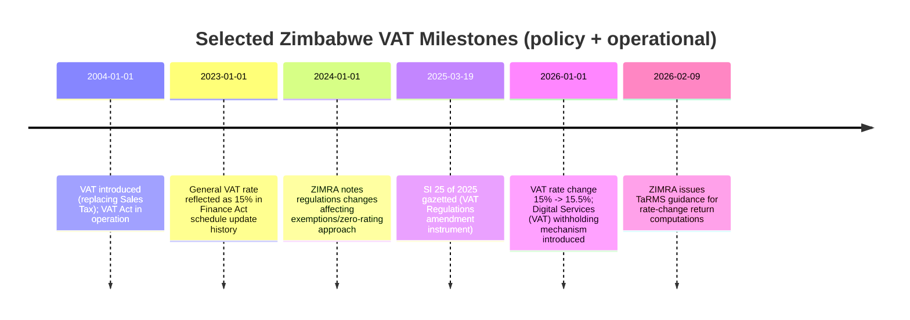

## Executive summary

Value Added Tax (VAT) in Zimbabwe is a broad-based, transaction-driven, **indirect tax on consumption** that is legally imposed on (i) **taxable supplies of goods or services by registered operators in the course or furtherance of trade** and (ii) **the importation of goods by any person**, with an additional charge on **imported services** and certain auctioneer-mediated sales. citeturn6view0turn28view0turn32view0  

The VAT system is designed to be collected **in stages along the supply chain** while (in principle) avoiding “tax-on-tax” through the **input tax / output tax mechanism**—meaning that businesses collect VAT on sales and (subject to rules) deduct VAT incurred on taxable business purchases, remitting only the net amount. This staged, credit-based design is widely explained in international VAT standards as supporting **neutrality** and reducing cascading compared to turnover/sales-tax styles of consumption taxation. citeturn28view0turn33search9turn33search1  

For Zimbabwe, VAT is not just doctrinally central—it is **fiscally dominant**. ZIMRA’s H2 2024 revenue performance data shows VAT as a major contributor (with VAT on local sales and imports together constituting a large share of net collections in that period). citeturn24view0  

A critical “current law” compliance point for 2026 is that ZIMRA has confirmed a **VAT rate change from 15% to 15.5% effective 1 January 2026**, with practical implications for TaRMS return computations where a tax period straddles the rate change. citeturn26view0  

VAT is also evolving to protect the base in the digital economy. ZIMRA confirms that, **from 1 January 2026**, section 13A was amended/substituted to introduce a **Digital Services (VAT) withholding mechanism** for certain electronic services supplied by non-residents and consumed in Zimbabwe. citeturn27view0  

---

## Lesson roadmap and study outcomes

This Lesson 1 is the *gateway* into Zimbabwe VAT. The aim is not to memorise every rule of zero-rating/exemptions yet; it is to master the **system logic** and the **legal architecture** so that later topics (definitions, imposition, rates, documentation, adjustments, audits) become mechanically solvable.

By the end of the lesson, an advanced student/practitioner should be able to:  
1) locate the statutory *charging hooks* for VAT in Zimbabwe (what is taxed, when, and who is liable), 2) explain why Zimbabwe replaced Sales Tax with VAT and what conceptually changed, 3) compute VAT correctly from VAT-exclusive and VAT-inclusive amounts under the **current 2026 rate environment**, and 4) recognise where ZIMRA focuses compliance attention (rates transitions, fiscalisation, digital services, imports). citeturn6view0turn26view0turn27view0turn24view0  

---

## Lesson content using the A–I framework

### A) Section context

**Placement in the chapter (where “Introduction to VAT” sits in the law).**  
The *Value Added Tax Act [Chapter 23:12]* is structured in Parts, beginning with **Part I (Preliminary)**—which includes interpretation/definitions critical to “what is VAT”, “what is trade”, “what is a taxable supply”, “who is a registered operator”—and then moving into substantive charging/administration provisions. The arrangement of sections explicitly identifies Part III as the VAT imposition core, including the central “Value Added Tax” charging provision (section 6). citeturn29view0turn6view0turn32view0  

**Practical importance (why this lesson is operationally decisive).**  
In practice, most VAT disputes and exam questions reduce to a disciplined application of:  
- **the charging provisions** (what transaction triggers VAT and on what base),  
- **status** (registered operator vs not; importer vs not), and  
- **rate mechanics** (including rate changes and VAT-inclusive pricing). citeturn6view0turn26view0turn32view0  

If you misclassify the transaction type (supply vs import vs imported services), you can be “correct” on later steps yet still arrive at a wrong liability conclusion—this is why Lesson 1 is a foundation.

**Examinability (why exam-setters love this topic).**  
Exams frequently test the “VAT mind” through seemingly simple fact patterns:  
- a supply chain with VAT-inclusive pricing,  
- a taxpayer “not registered” but exceeding thresholds,  
- imports where the wrong party is treated as the importer,  
- a tax period straddling a rate change. citeturn26view0turn35view0turn32view0  

**ZIMRA interest (where enforcement effort concentrates).**  
ZIMRA’s own published commentary highlights strong administrative focus on VAT base protection and compliance upgrades (including technology and policy reforms), and its revenue reporting shows VAT as a key revenue stream. citeturn24view0turn26view0turn27view0  
This is reinforced by operational notices in early 2026 on (i) the VAT rate migration in TaRMS and (ii) digital services withholding—both of which are compliance-heavy and audit-relevant areas. citeturn26view0turn27view0  

---

### B) Legislative framework

**Core primary instruments (the “VAT stack” you must cite correctly).**  
Zimbabwe VAT is built on a charging-and-administration architecture across multiple instruments:

**Value Added Tax Act [Chapter 23:12] (principal Act).**  
- The Act’s long title makes the policy and historical pivot explicit: it provides for taxation of supplies/imports and **repeals the Sales Tax Act [Chapter 23:08]** (with savings/transitional rules). citeturn29view0turn32view0  
- The Act defines the **“Charging Act”** as the Finance Act [Chapter 23:04] (or other enactment fixing rates). This is crucial: the VAT Act tells you *what* is taxed; the Charging Act tells you *at what rate*. citeturn29view0turn32view0  
- The Act’s charging core is **section 6**, which (in substance) levies VAT for the benefit of the Consolidated Revenue Fund on the value of:  
  - supplies of goods/services by registered operators in the course/furtherance of trade,  
  - importation of goods by any person,  
  - supply of imported services, and  
  - certain auctioneer-mediated sales by non-registered persons. citeturn6view0turn35view0turn32view0  

**Finance Act [Chapter 23:04] (Charging Act for rates).**  
- Chapter IV of the Finance Act sets VAT rates: section 29 provides that the VAT rate is “as set out in the Schedule”. citeturn12view0  
- In the Finance Act version updated to 1 Dec 2024, the Schedule to Chapter IV shows a **general VAT rate of 15%** (historical baseline before the 2026 change). citeturn12view0  
- **Current operational position (2026):** ZIMRA has publicly confirmed that the VAT rate **changed from 15% to 15.5% effective 1 January 2026** and has issued computational guidance for TaRMS submissions across that transition. citeturn26view0  

**VAT Regulations: SI 273/2003 as amended (Value Added Tax (General) Regulations, 2003).**  
- ZIMRA identifies the VAT Regulations (SI 273/2003) as enabling legislation alongside the VAT Act. citeturn28view0  
- The Regulations are made under the VAT Act’s regulation-making power (section 78) and prescribe practical compliance architecture: forms, prescribed amounts, administrative details, and schedules. citeturn7view0turn29view0  
- Amendments continue to occur through Statutory Instruments. For example, SI 25 of 2025 (gazetted 19 March 2025) is a VAT Regulations amendment instrument (noting ongoing maintenance of the regulatory framework). citeturn50search0turn50search2  

**ZIMRA guidance and practice communications.**  
While not legislation, ZIMRA public notices and web guidance are essential in practice because they set out system-handling rules (TaRMS configurations, withholding mechanisms, transition computations).  
- VAT rate change operational guidance for returns (Public Notice No. 7 of 2026). citeturn26view0  
- Digital Services Tax (VAT) framework and withholding mechanism implementation (Public Notice No. 05 of 2026). citeturn27view0  
- ZIMRA’s general taxpayer-facing explanation of VAT as an indirect consumption tax and its introduction in 2004 replacing Sales Tax. citeturn28view0turn29view0  

**Key interactions to understand in Lesson 1.**  
- **VAT Act ↔ Finance Act:** VAT Act imposes VAT “at such rate as may be fixed by the Charging Act”; Finance Act supplies the rate. citeturn6view0turn12view0turn26view0  
- **VAT Act ↔ Customs administration:** import VAT disputes often hinge on “who is the importer” and how customs documents are treated (see Afritrade). citeturn35view0  
- **VAT Act ↔ technological compliance:** Modern VAT enforcement includes fiscalisation and TaRMS return mechanics (reflected in ZIMRA compliance notices and the Act’s broader compliance architecture). citeturn26view0turn24view0turn29view0  

---

### C) Detailed conceptual explanation

#### What VAT is in Zimbabwe (legal meaning vs ordinary meaning)

**Ordinary meaning (economic concept).**  
VAT is a tax on consumption collected in stages. Each business charges VAT on sales and, subject to conditions, credits VAT paid on inputs, so that the tax burden in principle rests with the final consumer. This staged model is internationally recognised as supporting VAT neutrality and reducing cascading (tax-on-tax) compared with turnover taxes or poorly designed sales taxes. citeturn33search9turn33search1  

**Zimbabwean legal meaning (statutory design).**  
ZIMRA defines VAT in Zimbabwe as an **indirect tax on consumption** charged on taxable supplies and levied on **imports of goods and services**, introduced in 2004 to replace Sales Tax. citeturn28view0turn29view0  
Legally, however, you do not “start” with economics—you start with the **charging provisions** and the statutory definitions that determine when VAT is triggered.

#### The VAT charging “hooks” (the step-by-step statutory logic)

At an introductory level, Zimbabwe VAT is activated when **any** of the following “hooks” applies:

**Hook 1: Local taxable supplies by registered operators (the domestic VAT core).**  
VAT is charged on the value of supplies of goods/services by a **registered operator** in the course or furtherance of **trade** (statutory term) on or after the fixed date. citeturn6view0turn32view0  

- A **registered operator** is any person who is or is required to be registered under the Act, including a deemed registered operator from the date determined by the Commissioner under the registration provisions. citeturn32view0  
- **Trade** is defined broadly: it includes continuous/regular activities in Zimbabwe (or partly in Zimbabwe) involving supplies for consideration, whether or not for profit; it also contains explicit exclusions (e.g., certain private hobbies and exempt supplies not treated as “trade” to that extent). citeturn32view0  
- A **taxable supply** is any supply chargeable with VAT under the main charging provision, including zero-rated taxable supplies. citeturn32view0  

**Hook 2: Importation of goods (border VAT).**  
VAT is also levied on the value of the **importation of goods into Zimbabwe by any person**—meaning VAT can attach even if the importer is not carrying on “trade” as a registered operator in Zimbabwe. This distinction is central in Zimbabwean litigation and is expressly analysed in Afritrade. citeturn6view0turn35view0  

**Hook 3: Imported services (cross-border consumption).**  
The VAT charge extends to the supply of **imported services** (and, in the modern framework, certain electronic services are deemed supplied in Zimbabwe and collected through special mechanisms). citeturn6view0turn27view0  

**Hook 4: Auctioneer-mediated sales by non-registered persons.**  
The VAT Act also taxes certain goods and services sold through an auctioneer by persons who are not registered operators. citeturn6view0turn32view0  

#### The “VAT chain” concept: output tax and input tax at a high level

Although later lessons will define “input tax” and “output tax” in detail, the introduction needs the basic operational idea:

- A VAT-registered business charges VAT on taxable sales (economic “output VAT”) and incurs VAT on taxable purchases (economic “input VAT”). ZIMRA explains the return mechanism as: declare output tax and input tax, then **pay the difference if positive** or claim a refund/credit if negative (subject to rules). citeturn28view0  
- The BBB (“business-to-business”) credit mechanism is what (in principle) prevents cascading—an advantage often emphasised in VAT policy literature. citeturn33search9turn33search1  

#### VAT rate mechanics (Zimbabwe 2026 reality)

**Charging Act principle.**  
The VAT Act’s “Charging Act” concept anchors VAT rates in the Finance Act schedule architecture. citeturn32view0turn12view0  

**2026 rate change (high examinability + high ZIMRA interest).**  
ZIMRA confirms the rate change from **15% to 15.5% effective 01 January 2026**, and explains practical computations where a tax period straddles two rates (e.g., Category A returns for December 2025/January 2026). citeturn26view0  

**VAT-inclusive pricing (why “reverse” calculations matter).**  
VAT systems frequently quote prices VAT-inclusive at retail. Zimbabwean VAT litigation has reinforced the statutory deeming effect that VAT is included in the price charged for taxable supplies (see A.T. International discussion referencing the deeming rule). citeturn45view2  

For computations at the **15.5% rate**:  
- VAT-exclusive price = Base  
- VAT = Base × 15.5%  
- VAT-inclusive price = Base × 1.155  
- VAT portion in a VAT-inclusive amount = Inclusive × 15.5 / 115.5 (conceptually the tax fraction approach; the VAT Act defines “tax fraction” by formula tied to the rate r). citeturn32view0turn26view0  

#### Why Zimbabwe replaced Sales Tax with VAT (historical context that matters legally)

ZIMRA states that VAT was introduced in 2004 to replace the former Sales Tax regime. citeturn28view0  
The VAT Act itself operationalises that policy shift by repealing the Sales Tax Act [Chapter 23:08] (with savings). citeturn29view0turn32view0  

Conceptually, the policy rationale aligns with internationally recognised VAT advantages: staged collection and the credit mechanism can reduce cascading and distortions relative to turnover-style taxes, while remaining a strong revenue instrument. citeturn33search1turn33search9  

#### VAT in Zimbabwe’s tax mix (institutional context)

ZIMRA’s H2 2024 revenue performance report shows VAT (local sales and imports combined) as a leading revenue contributor in that period, confirming its centrality to the Zimbabwean revenue system and, consequently, ZIMRA compliance interest. citeturn24view0  

---

### D) Real-world applicability

Below are three Zimbabwean-facing examples designed to reflect the **legal hooks** in section 6, the **current 15.5% rate environment**, and realistic compliance thinking.

#### Example for an individual consumer (VAT paid invisibly through VAT-inclusive pricing)

**Facts.**  
Tapiwa buys a smartphone from a registered operator in Harare. The advertised shelf price is **ZiG 5,775 (VAT-inclusive)**.

**Analysis.**  
Retail pricing is typically VAT-inclusive; the VAT component must be extracted (reverse-VAT) using the tax-fraction logic tied to the statutory rate. Under the 15.5% rate effective 1 January 2026, VAT is computed by backing out the VAT portion from the VAT-inclusive amount. citeturn26view0turn32view0  

**Computation (15.5% VAT).**  
Let the VAT-exclusive value = V.  
- V × 1.155 = 5,775  
- V = 5,775 / 1.155 = 5,000  
- VAT = 5,775 − 5,000 = **775**

**Conclusion.**  
Tapiwa pays VAT economically, but legal liability and remittance are handled by the supplier as part of the domestic taxable supply system. citeturn6view0turn28view0  

#### Example for an SME/informal trader (non-registration and “hidden VAT costs”)

**Facts.**  
A small salon in Chitungwiza is not VAT-registered. In January 2026 it buys hair products from a VAT-registered wholesaler:
- VAT-exclusive invoice value: **USD 1,000**
- VAT at 15.5%: **USD 155**
- VAT-inclusive cost: **USD 1,155**

The salon provides services to consumers and charges USD 3,000 for the month (no VAT charged to customers because it is not registered).

**Analysis.**  
VAT is designed so that crediting prevents cascading only when the purchaser is within the VAT chain (i.e., registered and entitled to input tax deduction, subject to rules). In practice, non-registered traders cannot use the VAT credit mechanism, so VAT paid on inputs becomes a real cost embedded in prices. This economic effect is one reason VAT can “cascade” into informal or exempt segments, even though the formal VAT design aims to avoid cascading within the registered chain. citeturn33search1turn33search3turn28view0  

**Computation and implications.**  
- Input VAT cost locked in: **USD 155** (embedded in the salon’s cost base)  
- If the salon targeted a 40% gross margin on VAT-exclusive costs, but now costs include uncreditable VAT, its pricing and margin calculations are distorted unless it explicitly accounts for VAT leakage.

**Registration risk note (high practical importance).**  
ZIMRA’s published guidance states that compulsory VAT registration applies where taxable supplies exceed or are likely to reach **USD 25,000 (or ZiG equivalent) in 12 months** (from 1 Jan 2024). If such a salon grows, non-registration can become a compliance exposure. citeturn28view0turn27view0  

#### Example for a corporate taxpayer (registered operator: output tax minus input tax)

**Facts.**  
A VAT-registered manufacturer in Bulawayo (Category status ignored for this example) has the following January 2026 transactions:

1) Purchases local raw materials (taxable) from a registered supplier:  
- VAT-exclusive: **USD 40,000**  
- VAT (15.5%): **USD 6,200**  
- VAT-inclusive paid: **USD 46,200**

2) Imports packaging equipment:  
- Customs/VAT value (assume): **USD 20,000**  
- Import VAT at 15.5%: **USD 3,100**  

3) Sells finished goods locally (standard-rated taxable supplies):  
- VAT-exclusive sales value: **USD 100,000**  
- Output VAT (15.5%): **USD 15,500**  
- VAT-inclusive invoiced: **USD 115,500**

**Legal hook identification.**  
- Local sales by the company are taxed under the domestic supply hook (registered operator + trade + consideration). citeturn6view0turn32view0  
- Import VAT arises under the importation hook (VAT on importation of goods). citeturn6view0turn35view0  

**Return computation (conceptual).**  
- Output VAT: 15,500  
- Input VAT credits (subject to documentation and deduction rules in later lessons):  
  - Local inputs VAT: 6,200  
  - Import VAT: 3,100  
  - Total input VAT: **9,300**  
- Net VAT payable: 15,500 − 9,300 = **USD 6,200**

**Conclusion.**  
This illustrates the conceptual VAT “value-added” result: the business remits net VAT linked to its margin/value-add, while VAT on B2B inputs is (in principle) neutralised through input crediting. citeturn28view0turn33search9turn6view0  

---

### E) Case law integration

Zimbabwean VAT disputes frequently explore: (i) who is liable (registered operator vs importer), (ii) what constitutes trade in Zimbabwe (especially for foreign entities), and (iii) how statutory deeming rules affect VAT outcomes.

#### Afritrade International Limited v ZIMRA (Supreme Court)  

**Citation & posture.** Afritrade International Limited v ZIMRA, SC 3 of 2021 (appeal from the Fiscal Appeal Court). citeturn35view0  

**Core facts (as recorded in the judgment).**  
A foreign company supplied goods into Zimbabwe through complex arrangements involving local entities and the RBZ (BACOSSI era). ZIMRA assessed VAT, and disputes arose about the **identity of the importer** and the correct legal basis for VAT. citeturn35view0  

**Principles relevant to Lesson 1.**  
The Supreme Court’s reasoning (in the excerpted portion accessible) clarifies that **section 6 provides distinct VAT bases**, including VAT on supplies by registered operators and VAT on importation by the importer, and that these are not the same inquiry. The judgment explicitly contrasts **s 6(1)(a)** (trade-based supply) and **s 6(1)(b)** (importation-based liability) as “separate and distinct taxing bases,” a point that is foundational for introductory VAT analysis. citeturn35view0  

**How to apply (exam/practice).**  
When confronted with imports, your first question is not “is the person in trade?” but “who is the importer under the import VAT machinery?” You only move to the trade/registration-based supply hook if the transaction is actually being analysed as a domestic supply (or as a deemed supply in Zimbabwe). citeturn35view0turn6view0  

#### A.T. International Ltd v Zimbabwe Revenue Authority (High Court / Fiscal appeal context)  

**What it is (accessible text source).**  
This decision (as published on a Zimbabwean legal repository) addresses whether a foreign company was liable for Zimbabwe VAT, including disputes about trading in Zimbabwe, registration status, and VAT payment consequences. citeturn44view0turn45view2  

**Key facts (high level).**  
The taxpayer argued it had no local offices/staff and was not a VAT registered operator; ZIMRA contended it was trading in Zimbabwe and liable. citeturn44view0turn45view2  

**Principles relevant to Lesson 1.**  
- The court engages the **breadth of “trade”** and treats continuous, regular supply-linked activity as trading in Zimbabwe for VAT purposes. citeturn45view3turn45view1  
- Critically for an introductory lesson, the reasoning emphasises that even if a person is not formally registered, the VAT Act’s registration machinery can **deem** a person to be a registered operator from the date liability arose (the discussion references section 23(4)(b) deeming). citeturn45view2  
- The decision also highlights statutory deeming around VAT-inclusive pricing (VAT “deemed included in the purchase price”), which matters for VAT-inclusive computations. citeturn45view0turn45view2  

**How to apply (exam/practice).**  
Foreign-entity fact patterns often test whether activity is being carried on “in Zimbabwe or partly in Zimbabwe” and whether the Commissioner can treat the entity as within the VAT net (including via deeming provisions). Always separate: (i) *import VAT liability*, and (ii) *domestic supply/trade liability*, because they are not interchangeable. citeturn35view0turn45view2  

#### Other Zimbabwean VAT cases you should know exist (but not fully analysed here)

The VAT Act’s editorial annotations reference additional VAT-related cases on definitional issues (“trade”, “services”, “supply”, association not for gain, etc.). Where full judgments were not directly accessible in the research sources retrievable here, they are noted as **identified but not case-analyzed** for Lesson 1:  
- **T (Pvt) Ltd v ZIMRA (15-HH-285)** (VAT on travel agent reservation services) is cited in the VAT Act annotations. citeturn32view0turn47search1  
- **GTO Association v Commissioner-General of ZIMRA (19-HH-464)** (association not for gain context) appears in the Act’s definition notes. citeturn29view0  
- **Mylo (Pvt) Ltd v ZIMRA (16-HH-717)** appears next to the statutory definition of “supply”. citeturn32view0  

---

### F) Common pitfalls

**Rate-change errors (15% vs 15.5% and period straddles).**  
A classic 2026 trap is applying 15.5% to supplies deemed made before 31 Dec 2025 (or failing to adjust TaRMS figures when a return period combines December 2025 at 15% and January 2026 at 15.5%). ZIMRA has issued explicit computational steps for this. citeturn26view0  

**Conflating “import VAT” with “supply VAT”.**  
Afritrade underlines that import VAT and domestic supply VAT are distinct bases. In exams, students often incorrectly insist an importer must be a registered operator. In Zimbabwe law, VAT on importation attaches to “any person” as importer—not only registered operators. citeturn35view0turn6view0  

**Misusing VAT-inclusive vs VAT-exclusive amounts.**  
If a question says “VAT-inclusive” but you compute VAT as base × 15.5%, you overstate VAT. Conversely, extracting VAT requires the tax fraction logic tied to the statutory rate concept. citeturn26view0turn32view0  

**Thinking “not registered” equals “not liable”.**  
A.T. International illustrates the legal risk: the Commissioner may treat a liable person as a registered operator from the date they became liable (deeming logic). citeturn45view2  

**Overlooking that VAT is a major revenue head (hence audit attention).**  
ZIMRA’s revenue reporting indicates VAT’s importance; practically, that correlates with audit focus on VAT bases, exemptions/zero-rating, and system integrity (including technology-driven compliance). citeturn24view0  

**Digital economy confusion (electronic services vs physical goods).**  
ZIMRA stresses that Digital Services Tax (VAT) applies to electronic services by non-residents and is distinct from imported physical goods, which remain taxed as import VAT at the port of entry. citeturn27view0  

---

### G) Knowledge check

Answer without looking at Section H first. Assume the VAT rate is **15.5% from 1 January 2026** unless stated otherwise.

1) A retailer advertises a microwave at **USD 231 VAT-inclusive** in February 2026. What is the VAT-exclusive price and the VAT amount?  
2) A Zimbabwean non-registered sole trader imports goods (customs VAT value) of **USD 10,000** in January 2026. Must they pay import VAT? If yes, how much (ignoring customs duty)?  
3) A VAT-registered operator buys standard-rated inputs for **USD 11,550 VAT-inclusive** in January 2026 and sells outputs for **USD 57,750 VAT-inclusive** in the same period. Compute output VAT, input VAT, and net VAT payable (assume all documentation is valid and no apportionment issues).  
4) A non-resident supplies electronic subscription services consumed in Zimbabwe. What mechanism did ZIMRA state was introduced from **1 January 2026** to enhance VAT collection on such services?  
5) In a fact pattern involving both local supplies and imports, which Supreme Court principle should guide you in separating the VAT charging bases?

---

### H) Quiz answers with legislative reasoning and citations

**Answer 1 (VAT-inclusive extraction at 15.5%).**  
VAT-inclusive price = 231.  
VAT-exclusive = 231 / 1.155 = 200.  
VAT = 231 − 200 = 31.  
Reasoning: ZIMRA confirms the operative 15.5% rate effective 1 Jan 2026; VAT-inclusive extraction uses the rate-based tax fraction logic embedded in VAT computation practice. citeturn26view0turn32view0  

**Answer 2 (import VAT applies to “any person”).**  
Yes—import VAT applies on the importation of goods into Zimbabwe by **any person**, not only registered operators. VAT = 10,000 × 15.5% = **1,550**.  
Reasoning: VAT is levied on importation by any person under the import hook; Afritrade confirms the importance of treating import VAT as a distinct charging basis. citeturn6view0turn35view0turn26view0  

**Answer 3 (output VAT minus input VAT using VAT-inclusive figures).**  
Inputs VAT-inclusive: 11,550 → VAT-exclusive = 10,000; input VAT = 1,550.  
Outputs VAT-inclusive: 57,750 → VAT-exclusive = 50,000; output VAT = 7,750.  
Net VAT payable = 7,750 − 1,550 = **6,200**.  
Reasoning: ZIMRA describes the VAT mechanism as output tax less input tax to determine payable/refundable VAT. citeturn28view0turn26view0  

**Answer 4 (digital services withholding mechanism).**  
ZIMRA states that, with effect from 1 January 2026, the amended section 13A introduced a **Digital Services Withholding Tax mechanism**, requiring intermediaries to withhold tax when a consumer in Zimbabwe makes payment to a foreign supplier for digital services. citeturn27view0  

**Answer 5 (separate and distinct VAT bases).**  
Apply the Afritrade principle: section 6 contains **separate and distinct taxing bases**—notably, domestic supply VAT (trade/registered operator basis) versus import VAT (importer basis). Do not collapse them into a single test. citeturn35view0turn6view0  

---

### I) Key takeaways

VAT in Zimbabwe is best understood as a statutory system built around **charging hooks** plus definitions—especially “registered operator”, “trade”, “taxable supply”, and the importation rules. citeturn6view0turn32view0  

The **VAT Act imposes** VAT, but the **Finance Act (Charging Act) sets the rate**—and operationally, ZIMRA confirms that the standard rate is **15.5% from 1 January 2026** (15% before that date). citeturn32view0turn12view0turn26view0  

Import VAT is not “optional”: VAT on importation applies to **any person** as importer. Do not incorrectly require importer registration for VAT to arise. citeturn6view0turn35view0  

VAT’s design is staged and credit-based (output less input), aimed at preventing cascading within the registered chain; nevertheless, VAT can still embed into prices where credits are blocked (informal/unregistered segments). citeturn28view0turn33search9turn33search1  

VAT is a leading revenue head for Zimbabwe and therefore a persistent ZIMRA enforcement priority, especially on system integrity issues (rate migrations, digital services, imports). citeturn24view0turn26view0turn27view0  

Afritrade provides an exam-grade doctrinal anchor: **separate and distinct charging bases** for supplies vs imports under section 6—always classify the transaction correctly before computing. citeturn35view0turn6view0  

---

## Visual aids: tables and mermaid diagrams

### VAT vs Sales Tax in Zimbabwe (conceptual and historical comparison)

| Feature | VAT (Zimbabwe, from 2004) | Sales Tax (historical regime, repealed) |
|---|---|---|
| Legal status | Imposed under VAT Act [Chapter 23:12] (with rates fixed via the Charging Act). citeturn29view0turn32view0turn12view0 | Repealed by the VAT Act (with savings). citeturn29view0turn32view0 |
| Tax base | Broad: taxable supplies by registered operators + import VAT + imported services, etc. citeturn6view0 | Historically replaced; VAT introduced to replace Sales Tax regime. citeturn28view0turn29view0 |
| Collection mechanism | Staged collection with input/output offsets (invoice-credit style in practice). citeturn28view0turn33search9 | Sales taxes commonly risk cascading if designed as multi-stage turnover-type taxes; VAT policy literature highlights VAT’s advantage in reducing cascading. citeturn33search1turn33search9 |
| Imports/exports treatment (high level) | VAT explicitly covers importation; export/destination logic supports trade neutrality in VAT design generally. citeturn6view0turn33search9 | Replaced; VAT frameworks generally integrate border adjustments more coherently than older sales tax systems. citeturn33search1turn28view0 |
| Current operational complexity (2026) | Rate change (15% → 15.5%) and digital services withholding arrangements add transitional and tech-focused compliance tasks. citeturn26view0turn27view0 | Not applicable (repealed). citeturn29view0 |

### VAT in Zimbabwe’s tax mix (illustrative: H2 2024 contribution snapshot)

ZIMRA’s H2 2024 report states that net revenue contributions included Individuals (22%), Excise Duty (11%), and VAT totalling 30% (VAT on local sales 19% + VAT on imports 11%). citeturn24view0  

| Revenue head (H2 2024) | Approx. share (as stated by ZIMRA) |
|---|---:|
| VAT (total) | ~30% |
| VAT on Local Sales | ~19% |
| VAT on Imports | ~11% |
| Individuals (PAYE etc.) | ~22% |
| Excise Duty | ~11% |

### Timeline of Zimbabwe VAT evolution (selected milestones)



Milestones sourced from ZIMRA and statutory architecture descriptions (VAT introduction and replacement), Finance Act schedule history, the identified SI instrument, and ZIMRA public notices on digital services and rate migration. citeturn28view0turn29view0turn12view0turn50search0turn26view0turn27view0  

### VAT lifecycle flow (high-level)

```mermaid
flowchart TD
  A[Transaction occurs] --> B{Classify the VAT hook}
  B -->|Domestic supply| C[Registered operator + trade + consideration?]
  B -->|Import of goods| D[Importer pays import VAT at border]
  B -->|Imported services / e-services| E[Self-account or special digital mechanism]
  C --> F[Invoice/price VAT-inclusive or exclusive?]
  F --> G[Compute output VAT]
  G --> H[Claim input VAT (if entitled; documentation)]
  H --> I[Net VAT payable/refundable for tax period]
  I --> J[Submit return & pay per ZIMRA/TaRMS rules]
```
