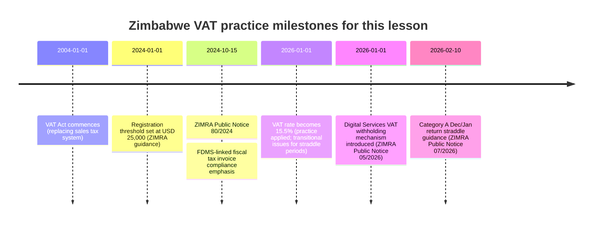

## Executive summary

This lesson converts Zimbabwe’s VAT law from “black-letter rules” into operational decision-making for real Zimbabwean businesses, grouped into six high-frequency practice modules: SMEs, informal traders, corporates, exporters, NGOs, and digital businesses. The legal spine for practical application is: (i) **charge VAT only if you are making taxable supplies as a registered operator (or are required to register)**; (ii) **compute net VAT as output tax less input tax**; (iii) **support every VAT position with compliant documentation (especially fiscal tax invoices and export proof)**; and (iv) **file and pay on time under your assigned VAT category, using TaRMS and fiscalisation/FDMS controls**. Zimbabwe has recently tightened VAT administration through **FDMS-linked fiscal tax invoices** and has expanded VAT into the digital economy through a **digital services withholding mechanism (effective 1 January 2026)**, which creates a “two-track” compliance reality: traditional VAT for resident businesses and a payment-intermediary withholding model for many cross-border electronic services. citeturn31view9turn31view11turn24view2

On rates, this lesson assumes the **general VAT rate is 15.5% from 1 January 2026**, while recognising transitional complexities for taxpayers whose tax periods straddle December 2025 (15%) and January 2026 (15.5%), especially Category A bi-monthly filers, as explained by ZIMRA. citeturn31view10turn24view1

Where a primary text is not directly accessible in this environment (notably some gazetted Finance Act consolidations and certain judgments hosted behind access controls), this lesson **anchors conclusions in ZIMRA-hosted consolidated legislation and official public notices** and flags any resulting limitations explicitly. citeturn3view0turn3view1turn24view2

## Sources, assumptions, and scope boundaries

Zimbabwean primary sources used first are ZIMRA-hosted consolidated PDFs for the **Value Added Tax Act [Chapter 23:12] (updated to 1 December 2024)** and the **Value Added Tax (General) Regulations (SI 273/2003 as amended; consolidated to 1 December 2024)**. citeturn3view0turn3view1  
Operational administration is drawn from **ZIMRA guidance pages** (registration, mechanics, refunds, categories) and **ZIMRA public notices** (FDMS/fiscal tax invoice compliance; VAT rate transition computations; digital services VAT withholding). citeturn27search13turn6search2turn5search21turn31view9turn31view10turn24view2  
Case law is integrated where accessible, especially **ZIMRA v Packers International (Pvt) Ltd SC 28/2016**, which is pivotal for compliance posture (“pay now, argue later”) and enforcement tools. citeturn28view0turn31view12

**Rate assumption for computations:** unless stated otherwise, calculate VAT at **15.5%** (effective 1 January 2026). For VAT-inclusive amounts at 15.5%, the VAT fraction is **15.5/115.5 = 31/231** (used in this lesson for standard VAT-inclusive computations). For **digital services withholding**, apply the **exact withholding rules stated by ZIMRA** (including the “3/23” tax fraction where specified) and treat any mismatch between that fraction and the 15.5% VAT fraction as a compliance risk/pitfall to manage with ZIMRA guidance and reconciliations. citeturn24view2turn31view11

**Practical portal references (official URLs shown in code to avoid link formatting):**
```text
TaRMS Self Service Portal: mytaxselfservice.zimra.co.zw
FDMS validation portal: fdms.zimra.co.zw
```
citeturn31view9

## A–I framework lesson

### Section context

**Placement in the statute and why it matters in practice**  
Practical VAT application sits mainly in (i) **Registration** (Part IV: section 23), (ii) **Tax periods, returns, and payment** (Part V: sections 27–28), (iii) **Invoices and documentation controls** (section 20 plus fiscalisation, enforced by public notices), and (iv) **special charging rules** (zero-rating, exemptions, and imported/digital services). citeturn11view0turn9view0turn13view0turn31view6turn24view2turn31view9

**Practical importance**  
ZIMRA’s enforcement model relies heavily on **self-assessment**—registered operators compute and pay, while ZIMRA audits and enforces afterwards. The Supreme Court notes the VAT system’s scale and that ZIMRA depends on self-assessment, supported by audits and recovery tools. citeturn28view0turn31view12

**Examinability and ZIMRA interest**  
The “high-yield” areas examiners and ZIMRA commonly focus on are: (i) **registration threshold and consequences of non-registration**, (ii) **output vs input tax computation and timing**, (iii) **valid fiscal tax invoices and FDMS validation**, (iv) **zero-rating proof (especially exports)**, (v) **category-based filing/payment discipline**, and (vi) **digital services VAT withholding mechanics and reconciliations**. citeturn9view0turn31view9turn13view0turn7search1turn24view2

### Legislative framework

#### Core charging and administration structure

**Registration liability (the gateway rule)**  
A person carrying on trade becomes liable to register **when taxable supplies in any rolling 12-month period exceed USD 25,000 (or equivalent)** (section 23(1)(a) as reflected in the consolidated VAT Act). citeturn9view0turn9view1  
ZIMRA’s registration guidance mirrors this and emphasises that failure to register when required allows the Commissioner-General to register the operator and assess VAT with interest and penalties. citeturn27search13turn9view0

**VAT categories and tax periods (compliance cadence)**  
Section 27 defines categories and links them to tax periods (monthly or bi‑monthly, with Category D as approved by the Commissioner). citeturn11view0turn7search1  
Operationally, ZIMRA states: Category A & B are **bi‑monthly**, Category C is **monthly**, Category D is **special** as allocated by the Commissioner (TaRMS profile). citeturn7search1

**Returns and payments**  
Section 28 requires filing and payment within the statutory period (traditionally “by the 25th day” after the tax period). citeturn11view0turn10view1  
However, ZIMRA has issued category-specific due dates (e.g., returns due the 10th and payments due the 15th for certain periods/categories under SI 81 of 2025, per public notices). In practice, businesses must follow the current TaRMS-configured deadline for their category and period and retain evidence. citeturn7search2turn7search10turn7search18

**Invoices, fiscalisation and FDMS (input tax protection rule)**  
Section 20 requires a supplier (registered operator) making a taxable supply to provide a tax invoice **within 30 days**. citeturn31view6  
ZIMRA’s Public Notice 80 of 2024 operationalises this by requiring fiscal invoices to be generated by a fiscal device interfaced with **FDMS**, and warning that **non-compliant invoices are not allowed for VAT input tax (and/or income tax expenditure) claims**; it also lists key invoice features and buyer-information capture expectations. citeturn31view9turn24view0

**Zero-rating and documentary proof (exporter risk zone)**  
Section 10 provides for zero-rating, including exported movable goods, subject to compliance, and requires the operator to obtain and retain **documentary proof acceptable to the Commissioner** for any zero-rating applied. citeturn8view0turn13view0turn31view2

#### Special regimes affecting this lesson’s six modules

**Exempt supplies relevant to common business models (including NGOs)**  
Section 11 exempts (among others) financial services, accommodation in a dwelling, passenger transport by road/rail, educational services (registered institutions), medical services, and “prescribed” items via regulations. Importantly for NGOs, section 11(b) exempts supplies by an **association not for gain** of donated goods or services, and certain goods manufactured substantially from donated goods. citeturn13view0turn8view3

**Prescribed exemptions via regulations**  
The VAT Regulations’ First Schedule (as amended/substituted over time) lists prescribed exemptions under section 11(j) (e.g., domestic water, domestic electricity, rates charged by a local authority, and other listed items). citeturn31view8turn22view4turn3view1

**Digital services VAT withholding from 1 January 2026**  
ZIMRA’s Public Notice 05 of 2026 explains that the amended section 13A retains the scope of electronic services and introduces a **Digital Services Withholding Tax** mechanism: intermediaries withhold when Zimbabwean consumers pay non-resident digital suppliers. The notice defines scope examples (OTT services, cloud storage, AI platform services, platform-based transport hailing, etc.), sets withholding rates, prescribes intermediary obligations, and provides registration and filing guidance for non-resident suppliers. citeturn24view2turn31view11

**VAT rate change and transitional TaRMS computations (1 January 2026)**  
ZIMRA’s Public Notice 07 of 2026 gives the computational method for Category A taxpayers whose December/January return is configured at 15.5% even though December supplies were at 15%; it also addresses other situations where time-of-supply rules require 15% output tax to be declared in 2026 returns. citeturn31view10turn24view1

### Detailed conceptual explanation

This section explains “how to do VAT” in Zimbabwe through the six modules, but using one consistent operational logic: **(1) classify the business and supplies; (2) decide registration; (3) set up invoicing and records; (4) calculate output tax; (5) determine input tax allowed; (6) file/pay/refund; (7) manage audits/objections.**

#### VAT for SMEs

**Classification and registration decision**  
SMEs often sit near the **USD 25,000** threshold. The legal test is not “annual turnover in a calendar year” but the rolling **12-month total value of taxable supplies**, evaluated monthly (section 23(1)(a)). citeturn9view0turn9view1  
ZIMRA clarifies that a trader must register if taxable supplies exceed or are expected to exceed USD 25,000 (or ZiG equivalent) in 12 months, and that the Commissioner-General may register non-compliant traders and assess VAT with penalties/interest. citeturn27search13

**Invoices and records**  
If registered, SMEs must issue fiscal tax invoices and preserve documentation. ZIMRA’s FDMS notice turns this into a hard control: non-FDMS compliant invoices are disallowed for input tax claims. citeturn31view9turn24view0

**Input tax timing and support**  
ZIMRA guidance states input tax claims must be made within **12 months of the invoice date**, supported by fiscal tax invoices, bills of entry, credit/debit notes, etc. citeturn5search0turn6search12

#### VAT for informal traders

**Core compliance reality**  
If not registered, an informal trader **must not charge VAT**. ZIMRA’s FAQ explicitly states that a non-registered trader is not supposed to charge VAT and should be reported if they do. citeturn7search0  
Even if below threshold, informal traders experience VAT because they pay VAT embedded in purchases from VAT-registered suppliers (they are the final consumer in that chain).

**When informal becomes formal**  
Once the 12‑month taxable supplies exceed USD 25,000, VAT registration becomes compulsory (section 23). citeturn9view0turn27search13  
ZIMRA also notes exclusions: traders solely dealing in exempt supplies, hobby activities, and employees supplying services to employers are not obliged to register. citeturn27search13

#### VAT for corporates

**Systems and scale**  
Corporates generally operate in Category C (monthly) or large bi-monthly filers, with high transaction volumes. The Supreme Court’s description of VAT administration highlights why corporates are audited: ZIMRA cannot monitor each transaction and relies on self-assessment, supported by investigations and audits. citeturn28view0turn31view12

**FDMS and invoice integrity**  
For corporates, input tax is a material balance-sheet line. Public Notice 80 of 2024 makes invoice integrity a structural compliance requirement: fiscal invoices must be FDMS‑interfaced, QR-verifiable, and contain the required particulars. citeturn31view9turn24view0

**Returns, payment discipline, and enforcement risk**  
Section 28 imposes filing/payment obligations. citeturn10view1turn11view0  
If corporates dispute assessments, **“pay now, argue later”** matters: in ZIMRA v Packers, the Supreme Court explains that VAT Act recovery tools ensure prompt revenue; payment is generally not suspended by objection/appeal unless directed, and ZIMRA may enforce through agents/garnishees under VAT Act powers discussed in the judgment. citeturn28view0turn31view12

#### VAT for exporters

**Default rule: exports can be zero-rated, but proof is everything**  
Zimbabwe treats export zero-rating as a controlled benefit: section 10 zero-rates certain exports and requires documentary proof acceptable to the Commissioner; ZIMRA’s guidance similarly stresses documentary proof for entitlement. citeturn13view0turn2search10turn5search2  
Operationally, exporters should align VAT proof with customs and exchange-control documents. RBZ requires exports to be declared on **Form CD1**, creating a key evidence trail for export reality. citeturn7search7

**Special export charges can override intuitive “exports are 0%” assumptions**  
The VAT Act contains special provisions imposing tax on exportation of specified commodities (e.g., unbeneficiated lithium, dimensional stone, medicinal cannabis products) notwithstanding general zero-rating. citeturn8view0turn4view4turn7search15  
In practice, exporters must check commodity-specific rules, not only the general export rule.

#### VAT for NGOs

**Not every receipt is consideration: donations can be outside VAT**  
The VAT Act’s definition of “consideration” excludes payments made as an **unconditional gift to an association not for gain**, separating donations from consideration for a taxable supply in appropriate cases. citeturn12view0turn12view1

**Exempt supplies: donated goods/services supplied by associations not for gain**  
Section 11(b) exempts supplies by associations not for gain of donated goods or services (and certain manufactured goods largely from donated inputs). This is a critical NGO “VAT shield,” but it can also restrict input tax recovery (because exempt supplies generally block input claims). citeturn13view0turn8view3

**PVO operational nuance: some PVO activities can fall under zero-rated service rules**  
Section 10 includes zero-rating categories for services, including provisions that capture certain services carried on by a private voluntary organisation in defined circumstances (as referenced in the consolidated Act). citeturn13view0turn31view2

**Prescribed exemptions and privileges**  
Some NGO-like entities may access VAT relief through “privileges by agreement” arrangements or designated immunities under the VAT Regulations’ tax relief provisions (commonly relevant to international organisations rather than domestic NGOs). citeturn31view7turn22view0turn3view1

#### VAT for digital businesses

**Two tracks from 1 January 2026**  
ZIMRA’s Public Notice 05 of 2026 establishes a split:

* For **local suppliers** of electronic services: normal VAT applies (registration threshold, output/input, invoicing). The notice states payments to local electronic service suppliers do **not** attract digital services withholding. citeturn24view2turn31view11  
* For **non-resident suppliers**: if not registered, intermediaries withhold 15.5% of the payment; if registered, intermediaries withhold a tax fraction (stated as 3/23) and the supplier claims withheld tax as a credit on its VAT return. citeturn24view2turn31view11

**Scope of taxable electronic services**  
The notice lists examples: OTT media, software, cloud storage, file-sharing, digital entertainment, search engine services, electronically supplied tickets, platform-based transport hailing, and AI platform services; it also clarifies that physical goods supplied in electronic format (e-books, digital newspapers/films) are classified as electronic services. citeturn24view2turn31view11

**Zero-rated and exempt services do not become taxable merely because they are electronic**  
ZIMRA confirms that if an electronic service would ordinarily be zero-rated or exempt if supplied in Zimbabwe (e.g., educational, medical, certain financial services), the same treatment applies even when supplied by non-residents. citeturn24view2

### Real-world applicability with Zimbabwean examples and computations

All examples use Zimbabwe’s VAT mechanics: **Net VAT payable/(refundable) = Output VAT − Input VAT**. ZIMRA describes VAT payable as the difference between output tax charged and input tax incurred by the registered operator. citeturn5search21turn6search2

#### Module VAT for SMEs

**Example SME-1 (SME retail; registered; February 2026 monthly period)**  
A small grocery in Highfield is VAT-registered (above threshold). It sells VAT-inclusive groceries and household items totaling **USD 20,000** for February 2026. Purchases: stock from wholesalers **USD 8,000 (VAT-exclusive)** plus VAT; packaging **USD 500 (VAT-exclusive)** plus VAT.

Computation (15.5%):
- Output VAT (sales VAT-inclusive): VAT fraction = 31/231.  
  Output VAT = 20,000 × 31/231 = **USD 2,683.98**.  
  Value of supply (exclusive) = 20,000 − 2,683.98 = **USD 17,316.02**.
- Input VAT:  
  Stock VAT = 8,000 × 15.5% = **USD 1,240.00**  
  Packaging VAT = 500 × 15.5% = **USD 77.50**  
  Total input VAT = **USD 1,317.50**
- Net VAT payable = 2,683.98 − 1,317.50 = **USD 1,366.48**

Key practical controls: input claims require compliant fiscal tax invoices; FDMS non-compliance risks disallowance. citeturn31view9turn5search0

**Example SME-2 (small professional services; not registered; below threshold)**  
A sole-proprietor graphic designer in Mutare earns **USD 1,400/month**, total **USD 16,800** over 12 months (all taxable services, but below USD 25,000). She is not VAT-registered and does not meet compulsory registration. citeturn27search13turn9view0

She invoices a client **USD 1,400** for March 2026:
- Output VAT: **USD 0.00** (not registered; must not charge VAT). citeturn7search0turn27search13  
- Input VAT: she purchased design software from a local VAT-registered supplier for **USD 115.50 VAT-inclusive** (VAT portion at 15.5% would be 115.50 × 31/231 = **USD 15.50**), but **cannot claim** because she is not a registered operator.

Net VAT position: **no VAT return and no input recovery**, meaning VAT on purchases becomes a cost.

**Example SME-3 (voluntary registration decision; cashflow vs credibility)**  
A start-up bakery in Gweru forecasts taxable supplies of **USD 28,000** in the next 12 months, so it expects to exceed the threshold and chooses to register early to avoid retro-registration risk. citeturn27search13turn9view0  
April 2026 figures: sales VAT-inclusive **USD 4,620**; inputs: flour and packaging VAT-exclusive **USD 2,000**.

Computation:
- Output VAT = 4,620 × 31/231 = **USD 620.00** (since 4,620 = 4,000 + 620 VAT)  
- Input VAT = 2,000 × 15.5% = **USD 310.00**  
- Net VAT payable = 620.00 − 310.00 = **USD 310.00**

Compliance emphasis: tax invoices must be issued within 30 days (section 20) and must meet fiscal tax invoice requirements. citeturn31view6turn31view9

#### Module VAT for informal traders

**Example INF-1 (informal clothing trader; unregistered; VAT as a hidden cost)**  
A Mbare flea-market trader buys clothing from a VAT-registered wholesaler. April purchases: **USD 1,155 VAT-inclusive**. Sales to customers: **USD 1,600** (unregistered, no VAT charged).

- Input VAT embedded in purchases (15.5%): 1,155 × 31/231 = **USD 155.00**  
- Output VAT: **USD 0.00** (cannot charge VAT while unregistered). citeturn7search0  
- Net VAT: **not claimable**; the USD 155 becomes a cost that reduces margin.

**Example INF-2 (informal trader crosses threshold in a rolling 12 months; becomes liable)**  
A home-based cosmetics reseller in Chitungwiza makes taxable supplies of **USD 2,500/month** consistently. After 10 months, rolling 12-month total is **USD 25,000**; at month 11, it reaches **USD 27,500**, exceeding the threshold → liable to register (section 23). citeturn9view0turn27search13  

Assume she registers and for the next month (Month 12) sells VAT-inclusive **USD 2,500**, and purchases VAT-exclusive **USD 1,000**.
- Output VAT = 2,500 × 31/231 = **USD 334.20**  
- Input VAT = 1,000 × 15.5% = **USD 155.00**  
- Net VAT payable = 334.20 − 155.00 = **USD 179.20**

Risk: if she failed to register when liable, ZIMRA indicates the Commissioner may compulsorily register and assess VAT, interest and penalties. citeturn27search13

**Example INF-3 (trader dealing solely in exempt supplies: passenger transport)**  
A kombi operator provides fare-paying passenger transport by road, which is exempt under section 11(f). citeturn13view0turn8view3  
Monthly fare collections: **USD 8,000**. Fuel purchases VAT-inclusive: **USD 1,155** (VAT portion 155).

- Output VAT on fares: **USD 0.00** (exempt supply)  
- Input VAT on fuel: **not recoverable** to the extent it relates to making exempt supplies (practical effect: VAT is a cost).

ZIMRA confirms that traders solely dealing in exempt supplies are not obliged to register. citeturn27search13turn13view0

#### Module VAT for corporates

**Example CORP-1 (manufacturing; standard-rated supplies; monthly Category C logic)**  
A Harare manufacturer sells standard-rated goods to local retailers: VAT-exclusive sales **USD 120,000** in March 2026. Inputs: raw materials VAT-exclusive **USD 70,000** (valid fiscal invoices), and a machine repair service VAT-exclusive **USD 5,000**.

- Output VAT = 120,000 × 15.5% = **USD 18,600.00**  
- Input VAT = (70,000 × 15.5%) + (5,000 × 15.5%)  
  = 10,850.00 + 775.00 = **USD 11,625.00**  
- Net VAT payable = 18,600.00 − 11,625.00 = **USD 6,975.00**

Key administrative discipline: file and pay under section 28/your category deadline, and maintain records as ZIMRA requires. citeturn10view1turn6search2turn7search1

**Example CORP-2 (retail chain; invalid invoice disallowance under FDMS rules)**  
A retail chain has April 2026 output VAT of **USD 50,000**. It claims input VAT of **USD 35,000**, but **USD 4,000** of that input relates to supplier invoices that fail FDMS validation (non-compliant fiscal invoices).

Per ZIMRA public notice: non-compliant fiscal tax invoices are not allowed for claiming VAT input tax. citeturn31view9turn24view0

So allowable input VAT = 35,000 − 4,000 = **USD 31,000**.
- Net VAT payable = 50,000 − 31,000 = **USD 19,000**

Corporate control implication: procurement must include invoice validation as a gating step before posting VAT recoveries.

**Example CORP-3 (Category A bi‑monthly return straddling Dec 2025 and Jan 2026 rate change)**  
A Category A taxpayer files for **Dec 2025/Jan 2026**. December supplies (VAT-exclusive value of supply) were **USD 40,000** at 15%; January supplies were **USD 50,000** at 15.5%.

- December output VAT at 15% = 40,000 × 15% = **USD 6,000**  
- January output VAT at 15.5% = 50,000 × 15.5% = **USD 7,750**  
Total output VAT for the bi‑month = **USD 13,750**

ZIMRA warns TaRMS may compute at 15.5% and instructs taxpayers to “work backwards” to compute an equivalent value of supply for the 15% portion, then add January value of supply, and declare the combined value so that TaRMS applies 15.5% and yields the correct combined output VAT. citeturn31view10turn24view1

Work-back step:
- Equivalent “value of supply” at 15.5% that yields USD 6,000 output VAT: VOS = 6,000 × 100 / 15.5 = **USD 38,709.68**
- Declare total VOS = 38,709.68 + 50,000 = **USD 88,709.68**  
TaRMS at 15.5% gives output VAT ≈ 88,709.68 × 15.5% = **USD 13,750**, matching the correct blended result.

This is a pure compliance computation issue; it does not change the underlying transaction VAT rates. citeturn31view10

#### Module VAT for exporters

**Example EXP-1 (horticulture exporter; zero-rated exports; refund position)**  
A farm-based exporter in Mazowe exports blueberries to an export country. Export sales VAT-exclusive **USD 60,000** in March 2026. Local taxable inputs VAT-exclusive **USD 30,000** (packaging, chemicals, logistics).

Assume export qualifies for zero-rating under section 10 and the exporter holds documentary proof acceptable to the Commissioner. citeturn8view0turn13view0

- Output VAT on exports = **USD 0.00**  
- Input VAT = 30,000 × 15.5% = **USD 4,650.00**  
- Net VAT position = **USD (4,650.00) refundable** (subject to refund rules, verification, and thresholds).

Evidence discipline: exporters should align VAT proof with export documentation; RBZ’s CD1 export declaration regime supports the “export actually occurred” element. citeturn13view0turn7search7turn5search21

**Example EXP-2 (exporter with commodity-specific export tax risk)**  
A mining exporter ships a commodity subject to a special export tax rule in the VAT Act (the Act contains provisions imposing VAT on exportation of certain commodities notwithstanding general zero-rating). citeturn8view0turn4view4  
Assume a taxable export value of **USD 100,000** and a specific export VAT rate set by law for that commodity of **10%** (illustrative; actual rate depends on commodity provision).  
- Output VAT = 100,000 × 10% = **USD 10,000**  
- Input VAT on local services and consumables VAT-exclusive **USD 40,000** = 40,000 × 15.5% = **USD 6,200**  
- Net VAT payable = 10,000 − 6,200 = **USD 3,800**

The lesson: exporters must not assume “all exports are 0%”; they must check the commodity-specific export charging provisions. citeturn8view0turn4view4

**Example EXP-3 (service exporter; conditions-based zero-rating of services)**  
A Zimbabwean software developer supplies services to a non-resident client outside Zimbabwe. Invoice VAT-exclusive **USD 25,000**. The contract states the services are for use outside Zimbabwe and the client is outside Zimbabwe when services are rendered; the service is not directly connected to land in Zimbabwe or movable property situated in Zimbabwe at the relevant time (a key statutory exclusion). These types of conditions appear in section 10’s service zero-rating categories. citeturn13view0turn31view2

Assuming the services qualify for zero-rating under section 10 and proof requirements are met:
- Output VAT = **USD 0.00**  
- Input VAT: local subcontractors VAT-exclusive **USD 8,000** → input VAT = 8,000 × 15.5% = **USD 1,240.00**  
- Net VAT position: **USD (1,240.00) refundable** (verification and refund rules apply).

Risk zone: if any statutory exclusion applies (e.g., service is directly connected to Zimbabwe-situated property), the supply may revert to standard rate and create unexpected VAT liability. citeturn13view0turn31view2

#### Module VAT for NGOs

**Example NGO-1 (association not for gain: exemption on donated goods/services supply)**  
A registered association not for gain runs a charity shop selling donated clothing. Monthly shop sales **USD 3,000**. Shop rent VAT-inclusive **USD 577.50** (VAT portion 77.50).

Under section 11(b), supply by an association not for gain of donated goods/services is exempt. citeturn13view0turn12view1

- Output VAT on sales = **USD 0.00** (exempt)  
- Input VAT on rent: **not recoverable** to the extent it relates to exempt supplies (practical effect: VAT is a cost).

This example shows a common NGO trade-off: exemption protects consumers/donors, but blocks input recovery.

**Example NGO-2 (unconditional donation is not consideration)**  
A donor grants **USD 50,000** to a qualifying association not for gain with no supply in return (pure donation).  
Because “consideration” excludes unconditional gifts to associations not for gain, there is **no output VAT** merely because money was received. citeturn12view0turn12view1

If the NGO uses the money to buy taxable goods/services costing VAT-inclusive **USD 11,550** (VAT portion = 11,550 × 31/231 = **USD 1,550**), the VAT is generally **not recoverable** unless linked to making taxable (including zero-rated) supplies.

**Example NGO-3 (PVO providing qualifying services in a zero-rated category)**  
A private voluntary organisation provides programme services deemed supplied to a public authority under the Act’s deeming rules referenced in section 10’s zero-rating categories. Assume it invoices a government agency **USD 20,000** for those services and qualifies for zero-rating (fact-sensitive). citeturn31view2turn13view0

- Output VAT = **USD 0.00** (if zero-rated)  
- Input VAT: programme supplies VAT-exclusive **USD 6,000** → **USD 930** input VAT  
- Net VAT position = **USD (930) refundable** (subject to refund process and verification).

If instead the services fail the zero-rating conditions, VAT could apply at standard rate, materially changing programme budgets.

#### Module VAT for digital businesses

**Example DIG-1 (local e-commerce retailer; standard VAT)**  
A Zimbabwe-registered online electronics shop sells VAT-inclusive goods worth **USD 11,550** in March 2026 (all standard-rated). Inputs (inventory purchases) VAT-exclusive **USD 8,000**.

- Output VAT = 11,550 × 31/231 = **USD 1,550.00**  
- Input VAT = 8,000 × 15.5% = **USD 1,240.00**  
- Net VAT payable = 1,550 − 1,240 = **USD 310.00**

The business must issue compliant fiscal tax invoices (section 20) and ensure FDMS compliance to protect customer input claims and its own audit posture. citeturn31view6turn31view9

**Example DIG-2 (consumer payment to non-resident streaming service; supplier not VAT-registered)**  
A Zimbabwe consumer pays **USD 10.00** for a subscription to a foreign streaming service. The supplier is not VAT-registered in Zimbabwe. Under ZIMRA’s notice, an intermediary must withhold **15.5% of the payment amount**. citeturn24view2turn31view11

- Tax withheld = 10.00 × 15.5% = **USD 1.55**  
- Amount remitted to foreign supplier = 10.00 − 1.55 = **USD 8.45**  
- Amount remitted to ZIMRA as Digital Services Tax = **USD 1.55**

Compliance fact: the withholding occurs at the time of processing a foreign payment and intermediaries must issue a withholding certificate reflecting key details. citeturn24view2

**Example DIG-3 (consumer payment to non-resident app store; supplier registered for VAT)**  
A Zimbabwe consumer pays **USD 23.00** to a foreign app store that is VAT-registered in Zimbabwe. ZIMRA’s notice says the intermediary withholds the **tax fraction of 3/23** where the foreign supplier is registered. citeturn24view2turn31view11

- Withholding = 23.00 × (3/23) = **USD 3.00**  
- Amount remitted to supplier = 23.00 − 3.00 = **USD 20.00**

The supplier then files a Zimbabwe VAT return and, per the notice, claims withheld tax as a credit and pays the balance (ZIMRA reconciles returns with amounts withheld). citeturn24view2

**Technical caution:** if the supplier’s VAT-inclusive pricing embeds VAT at 15.5%, the mathematically correct VAT fraction would be 31/231 rather than 3/23; the notice’s 3/23 withholding rule is therefore a potential reconciliation friction point. The safe practice is to follow ZIMRA’s stated rule, retain certificates, and manage reconciliation queries proactively. citeturn24view2turn31view11

### Case law integration

#### VAT for SMEs
Accessible Zimbabwe VAT case law most directly emphasising SME risk tends to centre on **registration failure** and **audit assessments**, but some key SME-relevant judgments are not directly accessible from closed repositories in this environment. Where the VAT Act itself references decisions (e.g., Afritrade International Limited v ZIMRA 21‑SC‑003 in the registration context), the primary statutory text confirms the threshold and liability mechanics regardless of judgment access. citeturn9view0

#### VAT for informal traders
No frequently-cited superior-court VAT decisions specific to informal traders were accessible in the sources consulted. The operational rule is instead enforced through ZIMRA administration: unregistered persons must not charge VAT; threshold triggers compulsory registration. citeturn7search0turn27search13turn9view0

#### VAT for corporates
**ZIMRA v Packers International (Pvt) Ltd SC 28/2016** is foundational for corporates:
- Facts (high level): ZIMRA required submission of VAT returns, issued/estimated assessments, and enforced collection via garnishee/agents; the taxpayer sought to interdict enforcement while appealing. citeturn28view0  
- Principle: VAT is designed to ensure prompt revenue; the “**pay now, argue later**” principle supports enforcement, discourages frivolous disputes, and protects the fiscus; appeals do not automatically suspend payment unless the Commissioner directs. citeturn31view12turn28view0  
- Application: corporates must treat VAT assessments and enforcement powers as immediate cashflow exposures; disputes should be pursued through objection/appeal channels without assuming payment suspension. citeturn31view12

#### VAT for exporters
Section 10’s documentary-proof requirement and the strict evidential approach are reinforced by the statute itself and ZIMRA administration. Exporters should assume a high audit probability for zero-rated claims and structure documentation and customs alignment accordingly. citeturn13view0turn2search10turn7search7

#### VAT for NGOs
The VAT Act’s definitions and exemptions provide the primary rule set (unconditional gifts excluded from consideration; exemption for associations not for gain supplying donated goods/services). citeturn12view0turn13view0  
The consolidated statutory text references **Law Society of Zimbabwe v ZIMRA (HH 409/18)** in the “consideration/unconditional gift” context, and contemporary reporting indicates the dispute concerned VAT on subscriptions and professional development fees, with the court finding exemption in terms of section 11(b) for qualifying services. Full judgment text was not directly accessible from the blocked repositories during this session, so the lesson relies on the statutory rule and flags this limitation. citeturn12view0turn13view0turn27search1turn27search6

#### VAT for digital businesses
No Zimbabwean superior-court judgments specific to the 2026 digital services withholding mechanism were identified in the accessible sources; the controlling “primary” operational source is ZIMRA’s Public Notice 05 of 2026, implementing the amended section 13A regime. citeturn24view2turn31view11

### Common pitfalls and exam traps

#### SME pitfalls
SMEs frequently fail by (i) applying the wrong threshold concept (calendar year instead of rolling 12 months), (ii) charging VAT while unregistered, (iii) claiming input tax without FDMS-valid invoices, (iv) claiming input tax outside the stated 12‑month claim window, and (v) missing category-based filing/payment deadlines because they rely on outdated “25th day” assumptions rather than current public notices/TaRMS. citeturn9view0turn7search0turn31view9turn5search0turn7search2turn6search2

#### Informal trader pitfalls
Common errors are (i) “adding VAT” to prices while unregistered (illegal), (ii) assuming VAT is optional once customers ask for invoices, (iii) ignoring that exempt-only traders should not register (but also cannot recover input VAT), and (iv) failing to monitor growth that triggers compulsory registration. citeturn7search0turn27search13turn9view0

#### Corporate pitfalls
Key traps include (i) accepting invalid/non-FDMS invoices and then failing audits, (ii) poor reconciliations between sales systems and VAT returns, (iii) misunderstanding “pay now, argue later” and expecting appeals to stop enforcement, and (iv) mishandling transitional rate changes in TaRMS (especially Category A). citeturn31view9turn31view12turn31view10

#### Exporter pitfalls
The main exporter errors are (i) applying zero-rating without documentary proof acceptable to the Commissioner, (ii) weak alignment of VAT proof with customs/export documentation (e.g., missing export declarations), and (iii) assuming every “export” is 0% without checking commodity-specific export charging provisions. citeturn13view0turn7search7turn4view4turn2search10

#### NGO pitfalls
Common mistakes are (i) treating all receipts as donations (when some are consideration for supplies), (ii) claiming input VAT while mainly making exempt supplies under section 11(b), (iii) failing to document “association not for gain” status and “donated goods/services” character, and (iv) mixing business activities with NGO activities without clear accounting separation (risking incorrect VAT profiles). citeturn12view0turn13view0turn12view1

#### Digital business pitfalls
The biggest traps are (i) misunderstanding the withholding split between registered and unregistered non-resident suppliers, (ii) treating withheld digital services tax as a “final tax” when ZIMRA expects VAT return reconciliation for registered suppliers, (iii) ignoring the notice’s confirmation that ordinary exemptions/zero-ratings still apply to qualifying electronic services, and (iv) failing to retain withholding certificates/records as required. citeturn24view2turn31view11

### Knowledge check per module

#### SMEs questions
**SME-Q1:** A trader has taxable supplies of USD 2,200 per month for 11 months and USD 3,000 in the 12th month. At what point is the trader liable to register, and why? citeturn9view0turn27search13  
**SME-Q2:** An SME claims USD 5,000 input VAT based on supplier invoices that are not FDMS-valid. What is ZIMRA’s stated treatment? citeturn31view9  
**SME-Q3:** An SME’s February 2026 VAT-inclusive sales are USD 11,550. Compute output VAT at 15.5%.  
**SME-Q4:** An SME files input tax claims 18 months after invoice date. Is this consistent with ZIMRA’s input-tax guidance? citeturn5search0turn6search12

#### Informal trader questions
**INF-Q1:** Can an unregistered informal trader charge VAT if the customer demands a fiscal tax invoice? citeturn7search0turn31view9  
**INF-Q2:** A kombi operator provides fare-paying passenger road transport. Is the supply taxable or exempt? What is the input VAT implication? citeturn13view0turn27search13  
**INF-Q3:** An informal trader’s rolling 12‑month taxable supplies exceed USD 25,000. What does section 23 require? citeturn9view0

#### Corporate questions
**CORP-Q1:** Explain “pay now, argue later” in Zimbabwe VAT and why it matters for dispute strategy. citeturn31view12turn28view0  
**CORP-Q2:** A corporate submits the Dec 2025/Jan 2026 Category A return. TaRMS computes at 15.5% but December supplies were at 15%. What does ZIMRA instruct the taxpayer to do? citeturn31view10  
**CORP-Q3:** A corporate has output VAT of USD 80,000 and input VAT of USD 70,000, but USD 12,000 input is from non-compliant fiscal invoices. Compute the VAT payable. citeturn31view9

#### Exporter questions
**EXP-Q1:** What two statutory controls must be satisfied for export zero-rating: the substantive rule and the evidence rule? citeturn8view0turn13view0  
**EXP-Q2:** Why is Form CD1 relevant to VAT export zero-rating risk management? citeturn7search7turn13view0  
**EXP-Q3:** An exporter has zero-rated exports of USD 50,000 and input VAT of USD 7,750 on taxable inputs. What is the net VAT position?

#### NGO questions
**NGO-Q1:** A donor gives USD 100,000 to an association not for gain, with no supply in return. Is that receipt “consideration” for VAT purposes? citeturn12view0turn12view1  
**NGO-Q2:** Identify the section that exempts supplies by an association not for gain of donated goods or services. citeturn13view0turn8view3  
**NGO-Q3:** If an NGO mainly makes exempt supplies under section 11(b), what is the typical input VAT consequence?

#### Digital business questions
**DIG-Q1:** Under ZIMRA’s 2026 notice, what conditions must exist for Digital Services Tax to apply? citeturn24view2  
**DIG-Q2:** A Zimbabwe consumer pays USD 40 to a non-resident supplier not registered for VAT. Compute the amount withheld. citeturn24view2turn31view11  
**DIG-Q3:** Name two examples of electronic services explicitly listed by ZIMRA as within scope. citeturn24view2  
**DIG-Q4:** For a registered foreign supplier, what does the notice say the supplier does with withheld tax when submitting VAT returns? citeturn24view2

### Quiz answers with legislative reasoning

#### SME answers
**SME-A1:** Liability arises in the 12th month when the rolling 12‑month taxable supplies exceed **USD 25,000**, because section 23 measures “the period of 12 months ending at the end of that month” and triggers registration when it is exceeded; ZIMRA repeats this threshold logic. citeturn9view0turn27search13  
**SME-A2:** ZIMRA states non-compliant fiscal tax invoices are **not allowed** for claiming VAT input tax. citeturn31view9  
**SME-A3:** VAT fraction at 15.5% is 31/231; output VAT = 11,550 × 31/231 = **USD 1,550**.  
**SME-A4:** ZIMRA’s guidance says input claims must be made on the VAT return within **12 months** of the invoice date; 18 months is outside that guidance and is high risk for disallowance. citeturn5search0turn6search12

#### Informal trader answers
**INF-A1:** No. ZIMRA states a non-registered trader is not supposed to charge VAT; fiscal tax invoices are a registered-operator compliance feature, and FDMS fiscal invoices are tied to registration. citeturn7search0turn31view9  
**INF-A2:** Passenger road transport in a transport business is exempt under section 11(f). Because the supply is exempt, input VAT linked to making that exempt supply is generally not recoverable (VAT becomes a cost). citeturn13view0turn27search13  
**INF-A3:** Section 23 requires the person to register when the rolling 12‑month value of taxable supplies exceeds USD 25,000. citeturn9view0

#### Corporate answers
**CORP-A1:** In ZIMRA v Packers, the Supreme Court explains VAT provisions are designed to secure a steady revenue stream and embody “pay now, argue later”: objections/appeals do not automatically suspend payment unless directed; enforcement tools (including agents/garnishees) protect the fiscus from delay. citeturn31view12turn28view0  
**CORP-A2:** ZIMRA instructs Category A taxpayers to compute December output tax at 15%, then “work backwards” to a value of supply that yields the same output tax if taxed at 15.5%, add January value of supply, and declare the combined value so TaRMS (at 15.5%) yields the correct blended output tax; attach a summary. citeturn31view10  
**CORP-A3:** Allowable input VAT = 70,000 − 12,000 = 58,000 (because non-compliant invoices cannot support input claims). VAT payable = 80,000 − 58,000 = **USD 22,000**. citeturn31view9

#### Exporter answers
**EXP-A1:** Substantive rule: section 10 provides zero-rating for exported movable goods in specified circumstances; Evidence rule: section 10(3) requires documentary proof acceptable to the Commissioner for any zero-rating applied. citeturn8view0turn31view2turn13view0  
**EXP-A2:** CD1 is the RBZ exchange-control export declaration requirement, supporting factual proof that goods were exported; exporters should align VAT evidence with CD1 and customs records to satisfy documentary proof expectations. citeturn7search7turn13view0  
**EXP-A3:** Output VAT = 0 (zero-rated), input VAT = 7,750 → net VAT **refundable** of USD 7,750 (subject to verification/refund process). citeturn13view0turn5search21

#### NGO answers
**NGO-A1:** It is excluded from “consideration” if it is an unconditional gift to an association not for gain (VAT Act definition of consideration), so the donation is not consideration for a taxable supply. citeturn12view0turn12view1  
**NGO-A2:** Section 11(b). citeturn13view0turn8view3  
**NGO-A3:** Exempt supplies generally block input recovery to the extent inputs are used to make exempt supplies; VAT on costs becomes an expense unless the NGO also makes taxable/zero-rated supplies that justify input claims. citeturn13view0turn12view1

#### Digital business answers
**DIG-A1:** Digital Services Tax applies where services are supplied electronically, the supplier is non-resident, and the services are consumed or utilised in Zimbabwe; it does not apply to imported physical goods, physically rendered services taxed under section 13, or services consumed outside Zimbabwe. citeturn24view2turn31view11  
**DIG-A2:** Withholding = 40 × 15.5% = **USD 6.20**. citeturn24view2turn31view11  
**DIG-A3:** Examples include OTT services (films/music/podcasts), cloud storage and file-sharing, software/firewalls, platform-based transport hailing, and AI platform services. citeturn24view2  
**DIG-A4:** The notice says the non-resident supplier claims withheld Digital Services Withholding Tax as a credit when submitting VAT returns and pays only the balance due; ZIMRA reconciles VAT returns with withheld amounts. citeturn24view2

### Key takeaways per module

#### SMEs takeaways
In Zimbabwe, SME VAT success is threshold discipline (section 23’s rolling 12‑month test), invoice integrity (section 20 plus FDMS), timely return/payment under the assigned tax category, and conservative input claims supported by compliant fiscal invoices within the practical claim window stated by ZIMRA; SMEs should treat VAT registration and invoicing as a systems transformation, not a paperwork add‑on. citeturn9view0turn31view6turn31view9turn5search0turn7search1

#### Informal trader takeaways
Informal traders must not charge VAT while unregistered; VAT is still paid implicitly through supplier prices; once the USD 25,000 rolling threshold is exceeded registration becomes compulsory; exempt-only activities (e.g., passenger transport) keep you outside compulsory registration but usually block input recovery, so VAT becomes a cost; the practical “VAT strategy” is often to decide whether formalising (registration) improves margins via input recovery or worsens competitiveness via price increases. citeturn7search0turn9view0turn13view0turn27search13

#### Corporate takeaways
Corporate VAT management is governance: FDMS-valid invoices protect input VAT, reconciliation between sales systems and VAT returns reduces audit exposures, and dispute strategy must assume “pay now, argue later” enforcement; transitional changes (like the 15%→15.5% rate shift) require careful TaRMS-aligned computations and documented workings for audit defence. citeturn31view9turn31view12turn31view10

#### Exporter takeaways
Exporters should treat zero-rating as a controlled entitlement: qualify substantively under section 10, satisfy the documentary proof requirement under section 10(3), and align VAT evidence with customs/exchange-control export documentation; expect refunds to trigger verification; and always check commodity-specific export charging provisions that can override intuitive “exports are 0%” assumptions. citeturn8view0turn31view2turn7search7turn4view4

#### NGO takeaways
For NGOs, the VAT boundary is the difference between donations and consideration: unconditional gifts to associations not for gain fall outside “consideration,” but fee-based activities can still be supplies; section 11(b) can exempt donated goods/services supplies, which protects recipients but generally blocks input recovery; NGOs should separate trading activities from donor-funded exempt activities in accounting to avoid cross-contamination of VAT positions. citeturn12view0turn13view0turn12view1

#### Digital business takeaways
From 1 January 2026, Zimbabwe’s digital VAT enforcement uses intermediaries to withhold tax on many cross-border electronic services; local electronic service suppliers remain under normal VAT; non-resident suppliers may need to register if they exceed the USD 25,000 threshold and must treat withheld digital services tax as creditable/reconcilable on VAT returns (not merely a consumer surcharge); exemptions and zero-ratings continue to apply to qualifying electronic educational/medical/financial services. citeturn24view2turn31view11turn27search13

## Cross-module comparison tables

### Compliance posture and input recovery at a glance

| Module | Typical registration status | Output VAT pattern | Input VAT recovery | Highest ZIMRA focus point |
|---|---|---|---|---|
| SMEs | Mixed: near-threshold; some voluntary | Standard-rated on local taxable sales | Allowed **only** with compliant fiscal invoices and to extent used for taxable/zero-rated supplies | Threshold breaches; FDMS invoice compliance; late filing/payment citeturn9view0turn31view9turn7search2 |
| Informal traders | Often unregistered until growth | No VAT charged if unregistered | None if unregistered; if exempt supplies, generally blocked | Unregistered charging; compulsory registration once threshold exceeded citeturn7search0turn9view0turn27search13 |
| Corporates | Usually registered; often Category C | Large output VAT volumes | Material; audit-controlled | FDMS validation; reconciliation; “pay now, argue later” enforcement citeturn31view9turn31view12 |
| Exporters | Registered if scale; export-driven | Often 0% output VAT on qualifying exports | Often refund positions | Documentary proof of export and zero-rating entitlement citeturn13view0turn2search10turn7search7 |
| NGOs | Many exempt activities; some taxable/zero-rated | Often exempt under s11(b) for donated supplies | Often blocked unless making taxable/zero-rated supplies | Misclassification of receipts; input claims on exempt activity citeturn12view0turn13view0 |
| Digital businesses | Local: normal VAT; foreign: register/withholding | Local standard-rated; foreign: intermediary withholding | Foreign registered supplier claims withheld as credit | Correct withholding rate/fraction; reconciliation; scope classification citeturn24view2turn31view11 |

### Current key numeric thresholds and administrative triggers

| Item | Amount / rule | Source |
|---|---:|---|
| Compulsory VAT registration threshold | USD 25,000 (or ZiG equivalent) in any 12-month period | citeturn9view0turn27search13 |
| VAT categories tax periods | A & B bi‑monthly; C monthly; D special | citeturn7search1turn11view0 |
| Fiscal tax invoice timing | Within 30 days of supply | citeturn31view6turn6search2 |
| FDMS requirement and input protection | Non-compliant invoices not allowed for VAT input claims | citeturn31view9turn24view0 |
| Input tax practical claim window (ZIMRA guidance) | Claim on VAT return within 12 months of invoice date | citeturn5search0turn6search12 |
| Digital services withholding when foreign supplier not registered | 15.5% of payment amount | citeturn24view2turn31view11 |
| Digital services withholding when foreign supplier registered | Tax fraction 3/23 (per ZIMRA notice) | citeturn24view2turn31view11 |

## Visual aids

### VAT lifecycle for a Zimbabwean registered operator

```mermaid
flowchart LR
A[Start: Business activity] --> B{Are supplies taxable?}
B -->|Exempt only| B1[No VAT registration required\n(usually no input recovery)]
B -->|Taxable/zero-rated supplies| C{12-month taxable supplies > USD 25,000\n(or expected to exceed)?}
C -->|Yes| D[Register (section 23)\nGet VAT number + TaRMS profile]
C -->|No| E[Remain unregistered or consider voluntary registration\n(eligibility per regs/commissioner)]
D --> F[Set up fiscal device + FDMS\nIssue fiscal tax invoices (section 20)]
F --> G[Collect output VAT on taxable supplies\n0% on qualifying zero-rated supplies]
G --> H[Capture input VAT from compliant documents\n(fiscal invoices, bills of entry, etc.)]
H --> I[Net VAT = Output - Input\nPay or claim refund]
I --> J[Submit return + pay by due date\n(per category + current public notices)]
J --> K[Audit/verification risk management\nKeep records & proof]
```

Anchors: compulsory registration threshold and FDMS invoice compliance are explicit ZIMRA focus points; returns/payment are core statutory obligations. citeturn9view0turn31view9turn10view1turn7search1

### Registration decision flowchart emphasising SMEs and informal traders

```mermaid
flowchart TB
A[Calculate rolling 12-month taxable supplies] --> B{> USD 25,000?}
B -->|No| C{Only exempt supplies?}
C -->|Yes| C1[Do not register\n(do not charge VAT)]
C -->|No| D[Consider voluntary registration\n(if eligible and beneficial)]
B -->|Yes| E[Must register\n(section 23)]
E --> F[Charge VAT + issue fiscal tax invoices\nFDMS compliant]
```

Threshold and “do not charge VAT if unregistered” are reinforced by ZIMRA guidance and the VAT Act. citeturn9view0turn27search13turn7search0turn31view9

### Timeline of practice-critical changes and notices



Timeline anchors are supported by ZIMRA registration guidance and public notices. citeturn27search13turn31view9turn31view10turn24view2
